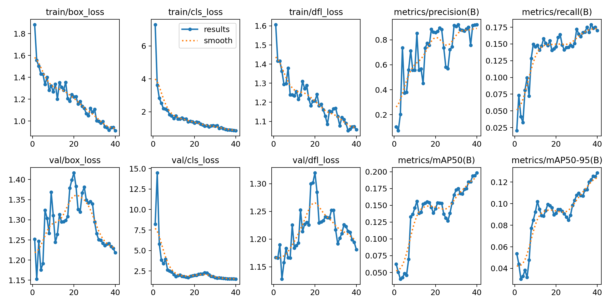
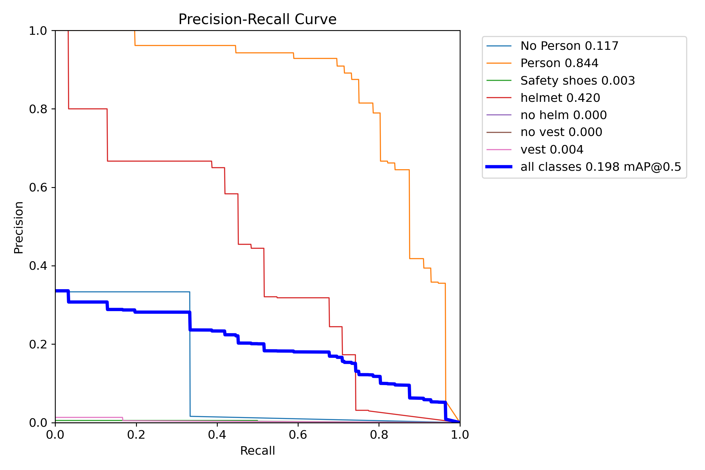
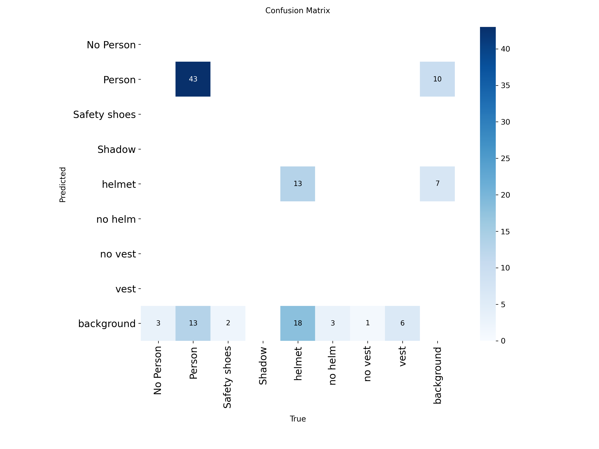
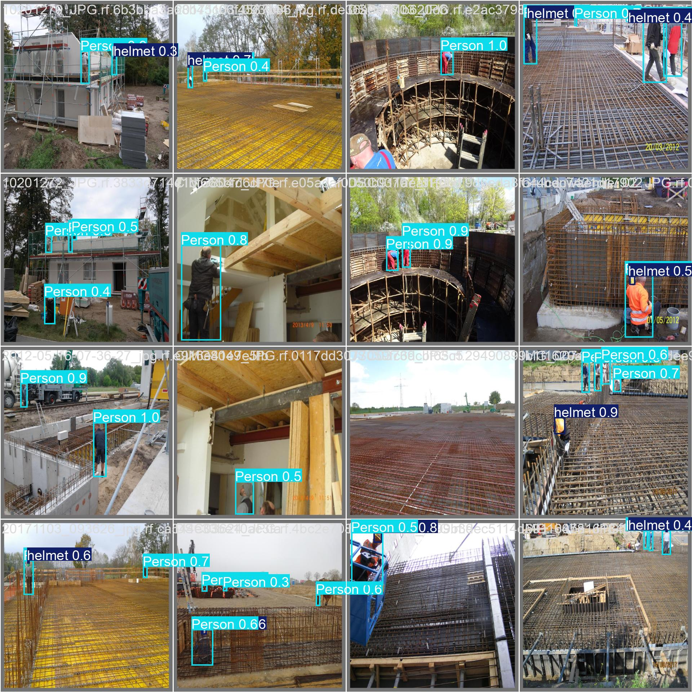

# Detección de Equipos de Protección Personal (PPE) en Obras AECO usando YOLOv8

## 1. Descripción del Problema (AECO)

En obras de construcción (sector AECO: Architecture, Engineering, Construction & Operations) es fundamental garantizar que los trabajadores utilicen correctamente los **Equipos de Protección Personal (PPE)** como cascos y chalecos reflectantes.

La supervisión manual en obra es lenta, costosa y puede ser inconsistente.  
Este proyecto explora el uso de **visión por computador con YOLOv8** para detectar automáticamente trabajadores y elementos de PPE en imágenes de obra.

### Caso de uso
**Automatic PPE compliance monitoring in construction sites.**

El sistema puede ayudar a:
- Supervisores de seguridad
- Coordinadores de obra
- Sistemas de monitoreo automático de seguridad

para verificar el cumplimiento del uso de PPE.

---

## 2. Dataset

El dataset fue creado y gestionado utilizando **Roboflow**.

Características principales:

- Plataforma: Roboflow
- Dataset: MAIC1125_M4T3
- Versión del dataset: v4
- Total de imágenes: 121
- Formato del dataset: YOLOv8

### División del dataset

- Train: 91 imágenes (75%)
- Validation: 20 imágenes (17%)
- Test: 10 imágenes (8%)

Dataset disponible en:

https://universe.roboflow.com/rossanas-workspace-ltw8l/maic1125_m4t3

### Preprocesamiento
- Auto-orient: aplicado
- Redimensionado: 640x640 (Stretch)

---

## 3. Clases del Dataset

El dataset incluye las siguientes clases:

**Personas**
- Person

**Elementos de protección personal (PPE)**
- helmet
- vest
- Safety shoes

**Incumplimiento de seguridad**
- no helm
- no vest

**Otras clases**
- Shadow
- No Person

La clase **Shadow** fue incluida intencionalmente para reducir falsos positivos
cuando el modelo detecta sombras de trabajadores como si fueran personas.

Durante la preparación del dataset apareció una clase vacía denominada
"3", sin instancias asociadas. Esta clase no afecta al entrenamiento.

---

## 4. Reglas de Etiquetado

Para mantener consistencia en las anotaciones se aplicaron las siguientes reglas:

- Las bounding boxes incluyen **todo el objeto visible**
- Se etiquetan objetos **parcialmente ocluidos**
- Los trabajadores siempre se etiquetan como `Person`
- El casco y chaleco se etiquetan **independientemente**
- Objetos demasiado pequeños o irreconocibles no se etiquetan

---

## 5. Modelo

Modelo utilizado:

yolov8s (Ultralytics)

Configuración de entrenamiento:

- Epochs: **40**
- Image size: **640**
- Batch size: **16**
- Framework: **Ultralytics YOLOv8**

Hardware de entrenamiento: 
Google Colab (CPU Intel Xeon)

---

## 6. Cómo reproducir el experimento

### Paso 1
Abrir el notebook en Google Colab:

train_yolov8_ppe.ipynb

### Paso 2
Configurar la API Key de Roboflow en **Colab Secrets**

Nombre del secret:

ROBOFLOW_API_KEY

### Paso 3
Ejecutar todas las celdas del notebook:

Runtime → Run All

El pipeline ejecutará automáticamente:

1. Descarga del dataset
2. Entrenamiento del modelo YOLOv8
3. Evaluación del modelo
4. Inferencia en imágenes de test
5. Exportación del modelo entrenado

---
## 7. Checklist de Reproducibilidad

Dataset
- Plataforma: Roboflow
- Dataset: MAIC1125_M4T3
- Versión del dataset: v4
- Total de imágenes: 121
- Formato del dataset: YOLOv8 (exportado desde Roboflow)
- División del dataset:
  - Train: 91 imágenes (75%)
  - Validation: 20 imágenes (17%)
  - Test: 10 imágenes (8%)

Modelo
- Arquitectura: YOLOv8
- Variante del modelo: yolov8s

Parámetros de entrenamiento
- Epochs: 40
- Batch size: 16
- Image size: 640

Entorno de ejecución
- Framework: Ultralytics YOLOv8
- Versión de Ultralytics: 8.4.21
- Framework backend: PyTorch
- Plataforma: Google Colab

Hardware utilizado
- Plataforma: Google Colab
- CPU: Intel Xeon

Nota:
El entrenamiento se ejecutó en CPU debido a las limitaciones de acceso a GPU
en la versión gratuita de Google Colab durante la ejecución del experimento.
---
## 8. Pipeline del experimento

El flujo del experimento consiste en:

1. Creación y etiquetado del dataset en Roboflow
2. Exportación en formato YOLOv8
3. Entrenamiento del modelo YOLOv8 en Google Colab
4. Evaluación del modelo usando el conjunto de validación
5. Inferencia sobre imágenes de test
6. Generación de métricas y visualizaciones

## 9. Resultados

Resultados obtenidos durante la validación del modelo:

- Precision: **0.92**
- Recall: **0.17**
- mAP@50: **0.198**
- mAP@50-95: **0.129**

Las siguientes gráficas fueron generadas automáticamente durante el entrenamiento del modelo:

### Curvas de entrenamiento

### Curva Precision-Recall

### Matriz de confusión

### Análisis del entrenamiento

Los gráficos de entrenamiento muestran una reducción progresiva de las funciones de pérdida (box loss, classification loss y DFL loss), lo que indica que el modelo fue capaz de aprender a localizar y clasificar objetos en el dataset.

La **precisión del modelo alcanza aproximadamente 0.92**, lo que indica que la mayoría de las detecciones realizadas por el modelo son correctas.

El **recall es relativamente bajo (≈0.17)**, lo cual es esperable debido al tamaño reducido del dataset y a la presencia de objetos pequeños como **helmet (casco)** o **safety shoes (botas de seguridad)**.

El valor de **mAP@50 alcanza aproximadamente 0.20**, mientras que **mAP@50-95 se sitúa cerca de 0.13**, lo cual es consistente con datasets pequeños en tareas multiclase de detección de objetos.

En conjunto, los resultados muestran que el modelo constituye un **prototipo funcional para la detección automática de equipos de protección personal (PPE) en obras de construcción**. El rendimiento podría mejorar mediante la ampliación del dataset y el entrenamiento con GPU.

### Análisis de la matriz de confusión

La matriz de confusión muestra que el modelo detecta la clase **Person** de forma relativamente confiable, con el mayor número de detecciones correctas.

Algunos objetos como **helmet (casco)** y **safety shoes (botas de seguridad)** no siempre son detectados, lo cual es esperable debido al tamaño reducido del dataset y al pequeño tamaño de estos objetos en varias imágenes.

La clase **Shadow** fue incluida intencionalmente para reducir falsos positivos cuando el modelo detecta trabajadores. En general, el modelo tiende a ignorar las sombras en lugar de clasificarlas incorrectamente como personas.

Este tipo de análisis permite identificar oportunidades de mejora del modelo mediante el aumento del dataset y una mayor diversidad de ejemplos de entrenamiento.

### Ejemplos de predicción

La siguiente figura muestra ejemplos de predicciones del modelo sobre el conjunto de validación.

El modelo es capaz de detectar correctamente la clase **Person** en la mayoría de las imágenes, así como identificar algunos elementos de equipo de protección personal como **helmet (casco)**.

Las puntuaciones de confianza varían entre **0.3 y 1.0**, lo cual es esperable dado el tamaño reducido del dataset.

En general, el modelo demuestra un comportamiento consistente en diferentes escenarios de obra, incluyendo estructuras, excavaciones y trabajos de armado de acero.

---
## 10. Inferencia del modelo

El modelo entrenado fue utilizado para realizar inferencias sobre el conjunto de prueba del dataset.

Los resultados muestran que el modelo es capaz de detectar correctamente trabajadores y algunos elementos de equipo de protección personal (PPE) como cascos y chalecos.

Las detecciones se generaron utilizando el modelo `best.pt` y un umbral de confianza de **0.25**.

Las imágenes con las predicciones generadas se guardaron automáticamente en la carpeta:

runs/detect/predict (directorio generado automáticamente durante la inferencia)

## 11. Prueba de reproducibilidad

Última ejecución exitosa: 7 de marzo de 2026

Entorno de ejecución:
- Plataforma: Google Colab
- Hardware: CPU Intel Xeon
- Framework: Ultralytics YOLOv8
- Versión de Ultralytics: 8.4.21

Tiempo estimado de ejecución:
- Entrenamiento completo (40 epochs): ~2–3 horas en CPU
- Verificación corta (5 epochs): ~20 minutos

Nota:
Durante la ejecución del experimento no se disponía de GPU en Google Colab. 
El entrenamiento se ejecutó completamente en CPU, lo cual aumenta el tiempo de entrenamiento pero no afecta la reproducibilidad del experimento.

Repositorio del proyecto:
https://github.com/ROMAPRE/aeco-ppe-detection-yolov8
-----

## 12. Conclusiones

1. El modelo YOLOv8 demuestra capacidad para detectar trabajadores y algunos elementos de equipos de protección personal (PPE) en imágenes de obra.
2. El tamaño reducido del dataset (121 imágenes) limita el rendimiento del modelo, especialmente en la métrica recall.
3. Incrementar el número de imágenes etiquetadas y mejorar la diversidad del dataset podría mejorar significativamente el recall y el mAP del modelo.
4. Este enfoque demuestra el potencial de la visión por computador para apoyar sistemas automáticos de monitoreo de seguridad en obras de construcción.
---

## 13. Trabajo Futuro

Posibles líneas de mejora del proyecto incluyen:

- Ampliar el dataset con un mayor número de imágenes de obra.
- Mejorar la consistencia y calidad de las anotaciones.
- Aplicar técnicas de **data augmentation** para aumentar la variabilidad del dataset.
- Evaluar modelos de mayor tamaño como **YOLOv8m** o **YOLOv8l**.
- Integrar el modelo en sistemas de monitoreo automático de seguridad en obra en tiempo real.

---

## 14. Modelo Entrenado

El modelo entrenado (`best.pt`) se generó durante el proceso de entrenamiento con YOLOv8.

El archivo del modelo se incluye en este repositorio dentro del archivo:

modelo_entrenado.zip

Este modelo puede utilizarse para realizar inferencias sobre nuevas imágenes de obra.
---

## 15. Tecnologías Utilizadas

Las principales tecnologías utilizadas en este proyecto fueron:

- **YOLOv8 (Ultralytics)** – modelo de detección de objetos
- **Roboflow** – gestión y anotación del dataset
- **Python** – lenguaje de programación
- **PyTorch** – framework de deep learning
- **Google Colab** – entorno de ejecución en la nube
- **Jupyter Notebook** – desarrollo del pipeline de entrenamiento

## 16. Modelo entrenado

Debido al tamaño del archivo, el modelo entrenado (best.pt) se encuentra disponible en el siguiente enlace:

https://drive.google.com/file/d/1OY66H3SZTURFskA8Cf_CdRIFCpKmIAEL/view

Permisos: acceso público en modo lectura (download enabled).

## 17. Pesos del modelo

El archivo `best.pt` contiene los pesos del modelo YOLOv8 entrenado durante el proceso de entrenamiento.

Puede descargarse aquí:

[Descargar best.pt](https://github.com/ROMAPRE/aeco-ppe-detection-yolov8/blob/main/results/best.pt)

## 18. Paquete PDF del proyecto

El proyecto incluye un paquete PDF con la documentación resumida:

### Diapositivas

[Descargar Diapositivas](docs/Diapositivas.pdf)

### Mini_informe

[Descargar Mini_informe](docs/Mini_informe.pdf)
